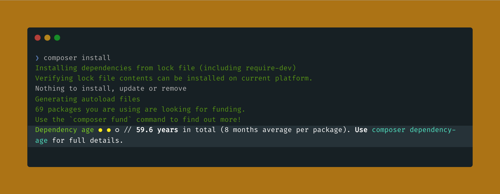
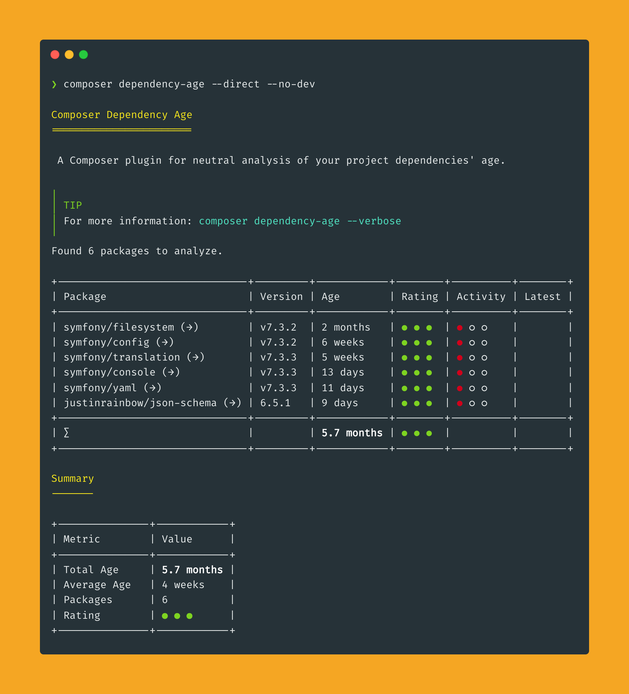
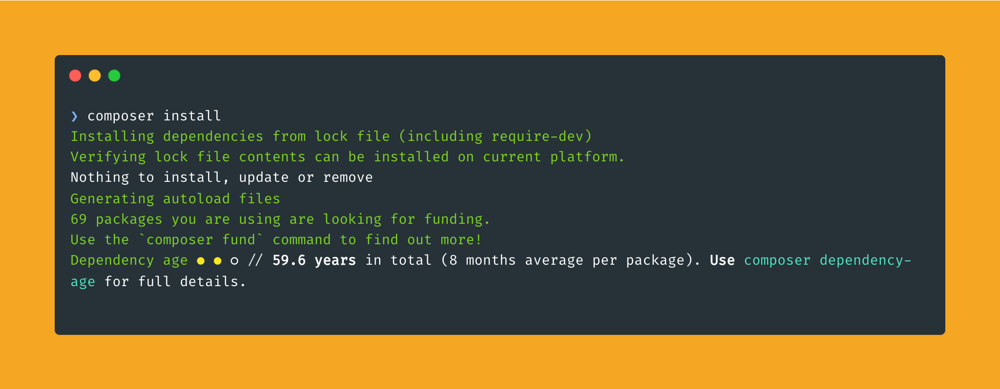

<div align="center">

# Composer Dependency Age

[](https://coveralls.io/github/jackd248/composer-dependency-age)
[](https://github.com/jackd248/composer-dependency-age/actions/workflows/cgl.yml)
[](https://github.com/jackd248/composer-dependency-age/actions/workflows/tests.yml)
[](https://packagist.org/packages/konradmichalik/composer-dependency-age)

</div>

A Composer plugin that analyzes the age of your project dependencies and provides neutral categorization to help you understand your dependency landscape. No risk assessment - just clear, objective information about when your dependencies were last released.



> [!warning]
> This package is in early development stage and may change significantly in the future. I am working steadily to release a stable version as soon as possible.

> [!note]
> Understanding the age of your dependencies is crucial for maintaining a healthy codebase.
> While newer isn't always better, knowing when your dependencies were last updated helps you make informed decisions about maintenance, security planning, and technical debt management.
> This tool provides objective age categorization without making assumptions about what you should do - empowering you to prioritize updates based on your project's specific needs, risk tolerance and maintenance windows.

## ✨ Features

- **Neutral Age Analysis** - Categorizes dependencies as Current, Medium, or Old based on release dates
- **Release Cycle Analysis** - Analyzes dependency activity patterns with 4-tier activity rating
- **Multiple Output Formats** - CLI table, JSON for automation, GitHub-formatted for PRs
- **Flexible Filtering** - Analyze all dependencies or focus on direct ones only
- **Smart Caching** - Caches Packagist API responses with configurable TTL for better performance
- **CI/CD Ready** - Perfect for automated dependency auditing in your build pipelines
- **Highly Configurable** - Customize thresholds, ignore lists, and output preferences

## 🔥 Installation

```bash
composer require konradmichalik/composer-dependency-age --dev
```

## 📊 Usage

### Command
Run the command to fully analyze your dependencies:

```bash
composer dependency-age
```



#### Command Line Options

| Option | Description | Default |
|--------|-------------|---------|
| `--format` | Output format: cli, json, github | cli |
| `--direct` | Show only direct dependencies | false |
| `--no-dev` | Exclude development dependencies | false |
| `--no-colors` | Disable color output | false |
| `--no-cache` | Disable caching | false |
| `--offline` | Use cached data only | false |
| `--ignore` | Comma-separated packages to ignore | - |
| `--thresholds` | Custom age thresholds (years) | current=0.5,medium=1.0,old=2.0 |
| `--no-release-cycles` | Disable release cycle analysis | false |


### Automatic Analysis
The plugin automatically runs after `composer install` and `composer update` operations, providing immediate feedback on your dependency landscape.

```shell
$ composer install
```



## 📝 Configuration

Configure the plugin via `composer.json`

```json
{
  "extra": {
    "dependency-age": {
      "thresholds": {
        "current": 0.5,
        "medium": 1.0,
        "old": 2.0
      },
      "ignore": ["psr/log", "psr/container"],
      "output_format": "cli",
      "include_dev": false,
      "cache_ttl": 2592000,
      "event_integration": true,
      "event_operations": ["install", "update"],
      "event_force_without_cache": false,
      "enable_release_cycle_analysis": true,
      "release_history_months": 24
    }
  }
}
```

## 🧑‍💻 Contributing

Contributions are welcome! Please see [CONTRIBUTING.md](CONTRIBUTING.md) for guidelines.

## ⭐ License

This project is licensed under the GNU General Public License v3.0 - see the [LICENSE](LICENSE.md) file for details.
